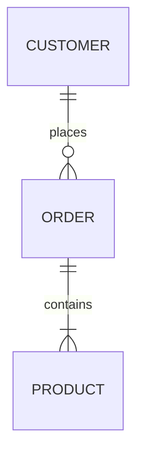

# 🤖 SQL-to-Dashboard with AI (Simplified LLM-Only Architecture)

Transform database schemas into interactive dashboards using AI-powered SQL generation.

## ✨ Key Features

- **100% AI-Powered**: All SQL queries generated by LLM for intelligent, context-aware results
- **Natural Language Support**: Describe what you want in plain English
- **Business Context Understanding**: Automatically detects e-commerce, finance, healthcare domains
- **Smart Visualizations**: AI recommends the best chart types for your data
- **Local & Private**: Uses Ollama for 100% local LLM processing

## 🚀 Quick Start

### Prerequisites

1. **Install Ollama** (Required)
   ```bash
   # macOS
   brew install ollama
   
   # Linux
   curl -fsSL https://ollama.ai/install.sh | sh
   ```

2. **Start Ollama**
   ```bash
   ollama serve
   ```

3. **Pull LLM Model**
   ```bash
   ollama pull llama3
   ```

4. **Install Python Dependencies**
   ```bash
   pip install -r requirements.txt
   ```

## 📊 Usage - Complete Workflow

### 🎯 Step-by-Step: From YOUR Schema to Dashboard

#### Step 1: Prepare Your Schema File

Create your schema file in either format:

**Option A: SQL DDL** (`your_schema.sql`)
```sql
CREATE TABLE your_table (
    id INTEGER PRIMARY KEY,
    name VARCHAR(100),
    created_at TIMESTAMP
);
```

**Option B: Mermaid Diagram** (`your_diagram.mermaid`)


#### Step 2: Generate AI-Powered SQL Queries

```bash
# For SQL DDL file
python3 client/mcp_client.py parse -i your_schema.sql

# For Mermaid diagram
python3 client/mcp_client.py parse -i your_diagram.mermaid

# Save queries for later use (optional)
python3 client/mcp_client.py parse -i your_schema.sql -o queries.json
```

**What happens:**
- AI analyzes YOUR schema structure
- Detects YOUR business domain
- Generates SQL queries specific to YOUR tables
- Shows recommended visualizations

#### Step 3: Run Generated Queries in YOUR Database

1. Copy one of the generated SQL queries from the output
2. Execute it in your actual database:
   ```sql
   -- Example: Copy and run in your database
   SELECT category, SUM(amount) as total 
   FROM your_table 
   GROUP BY category;
   ```
3. Export results as JSON:
   ```json
   [
     {"category": "A", "total": 1000},
     {"category": "B", "total": 2000}
   ]
   ```
4. Save as `data.json`

#### Step 4: Generate Dashboard

```bash
# Create dashboard from your query results
python3 client/mcp_client.py dashboard -d data.json -o my_dashboard.html

# Open in browser
open my_dashboard.html  # macOS
xdg-open my_dashboard.html  # Linux
start my_dashboard.html  # Windows
```

### 🚀 Quick Example with Your Own Data

```bash
# Complete workflow in practice

# 1. Create your schema file
cat > company_db.sql << 'EOF'
CREATE TABLE employees (
    id INTEGER PRIMARY KEY,
    name VARCHAR(100),
    department VARCHAR(50),
    salary DECIMAL(10,2),
    hire_date DATE
);

CREATE TABLE departments (
    id INTEGER PRIMARY KEY,
    name VARCHAR(50),
    budget DECIMAL(10,2)
);
EOF

# 2. Generate AI queries for YOUR schema
python3 client/mcp_client.py parse -i company_db.sql

# AI will generate queries like:
# - "Employee distribution by department"
# - "Average salary analysis"
# - "Hiring trends over time"
# - "Department budget utilization"

# 3. Run a query in YOUR database and save results
# 4. Generate YOUR dashboard
python3 client/mcp_client.py dashboard -d your_results.json -o dashboard.html
```

### Natural Language Queries

```python
from ddl_parser_mcp.server import DDLParserMCPServer

# Initialize (requires Ollama running)
server = DDLParserMCPServer()

# Your schema
schema = server.parse_ddl(your_ddl)

# Generate SQL from natural language
query = server.generate_natural_language_query(
    "Show me top selling products by category",
    schema
)

print(query.query)  # SELECT p.category, SUM(s.amount)...
```

## 🏗️ Simplified Architecture

```
┌──────────────────────┐
│    User Request      │
└──────────┬───────────┘
           ▼
┌──────────────────────┐
│   DDL Parser (LLM)   │  ← Always uses AI
│  • Schema Analysis   │
│  • Query Generation  │
│  • Business Context  │
└──────────┬───────────┘
           ▼
┌──────────────────────┐
│     Ollama LLM       │  ← Local AI Processing
│    (llama3, etc.)    │
└──────────┬───────────┘
           ▼
┌──────────────────────┐
│   Dashboard Gen      │
│  • Auto-detect viz   │
│  • Interactive HTML  │
└──────────────────────┘
```

## 🧪 Testing

```bash
# Run simplified test suite
python3 test_simplified.py
```

This will verify:
- ✅ Ollama is running (required)
- ✅ LLM-powered DDL parsing
- ✅ Natural language to SQL
- ✅ Dashboard generation
- ✅ End-to-end workflow

## 📁 Project Structure (Simplified)

```
sql_to_dashboard/
├── ddl_parser_mcp/
│   ├── server.py         # Single LLM-powered server
│   ├── parser/           # DDL parsing with sqlglot
│   └── schema.py         # Data models
├── llm/
│   ├── ollama_connector.py   # Ollama integration
│   └── sql_intelligence.py   # AI query generation
├── dashboard_generator_mcp/   # Dashboard creation
└── client/
    └── mcp_client.py     # CLI interface
```

## 💡 What Changed?

### Before (Complex)
- Two server implementations
- 300+ lines of template-based SQL generation
- Conditional LLM checks everywhere
- Fallback logic for when LLM unavailable
- Inconsistent query quality

### After (Simple)
- **One server** that always uses LLM
- **No templates** - all queries AI-generated
- **No conditionals** - LLM is required
- **No fallbacks** - consistent behavior
- **Better quality** - AI understands context

## 🎯 Benefits

1. **Simpler Code**: ~500+ lines removed
2. **Better Queries**: AI generates context-aware SQL
3. **Natural Language**: Describe what you want
4. **Business Understanding**: AI detects your domain
5. **Maintainable**: Single code path, no dual logic

## 🔧 Configuration

### Environment Variables

```bash
# Ollama settings
export OLLAMA_HOST="http://localhost:11434"
export OLLAMA_MODEL="llama3"  # or codellama, mistral, etc.
```

### Supported Models

| Model | Best For | Speed |
|-------|----------|-------|
| llama3 | General purpose | Medium |
| codellama | SQL generation | Fast |
| mistral | Quick responses | Fast |

## 🛠️ Troubleshooting

### Ollama Not Running
```bash
# Check status
curl http://localhost:11434/api/tags

# Start Ollama
ollama serve
```

### Model Not Available
```bash
# List models
ollama list

# Pull model
ollama pull llama3
```

## 📚 Examples

### E-commerce Schema
```sql
CREATE TABLE customers (
    id INTEGER PRIMARY KEY,
    name VARCHAR(100),
    email VARCHAR(255)
);

CREATE TABLE orders (
    id INTEGER PRIMARY KEY,
    customer_id INTEGER,
    order_date DATE,
    FOREIGN KEY (customer_id) REFERENCES customers(id)
);
```

The AI will:
- Detect "e-commerce" domain
- Generate queries for customer analytics
- Suggest sales dashboards
- Create optimized SQL for your database type

## 🤝 Contributing

This simplified architecture makes contributions easier:
- Single code path to understand
- Clear LLM integration points
- No complex fallback logic
- Better testability

## 📄 License

MIT License - See LICENSE file

## 🚨 Important Note

**This system requires Ollama to be running.** There are no fallbacks. This is by design - we've simplified the architecture to always use AI for consistent, high-quality results.

---

*Simplified architecture = Better maintainability + Superior functionality*