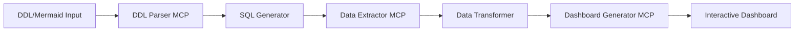
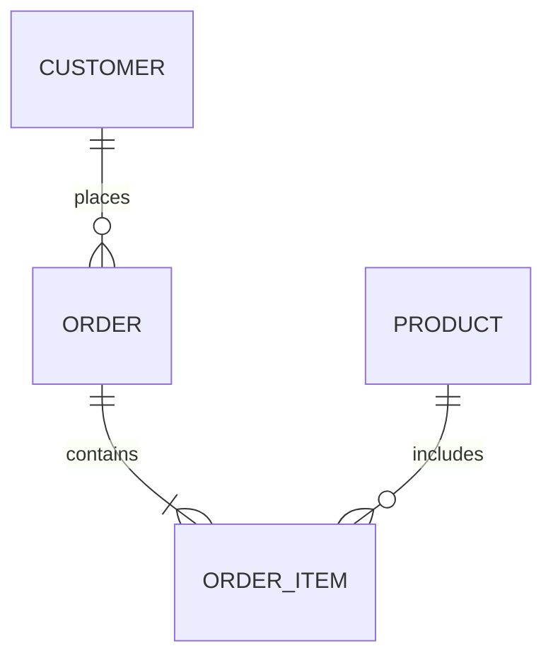

# 🎯 SQL-to-Dashboard MCP Tool Ecosystem

Transform database schemas (DDL/Mermaid) into interactive D3.js dashboards through intelligent MCP tool orchestration.

## 🚀 Quick Start

### Prerequisites
```bash
# Python 3.11+
python --version

# Node.js 18+ (for D3.js assets)
node --version

# Install dependencies
pip install -r requirements.txt
```

### Basic Usage
```bash
# Start with a simple SQLite example
python client/mcp_client.py \
  --input examples/sample_schema.sql \
  --database sqlite:///example.db \
  --output dashboard.html

# Or use Mermaid ER diagram
python client/mcp_client.py \
  --input examples/schema.mermaid \
  --database sqlite:///example.db \
  --visualizations "bar,line,table"
```

## 📁 Architecture



## 🧩 Components

### 1. DDL Parser MCP (`ddl_parser_mcp/`)
- **Purpose**: Parse DDL statements and Mermaid ER diagrams
- **Input**: SQL DDL or Mermaid syntax
- **Output**: Normalized schema graph + suggested queries
- **Supported**: PostgreSQL, MySQL, SQLite DDL; Mermaid ER

### 2. Data Extractor MCP (`data_extractor_mcp/`)
- **Purpose**: Execute queries and transform data
- **Input**: SQL queries + connection info
- **Output**: JSON/CSV formatted data
- **Features**: Pagination, timeouts, aggregations

### 3. Dashboard Generator MCP (`dashboard_generator_mcp/`)
- **Purpose**: Create interactive D3.js visualizations
- **Input**: Data + visualization spec
- **Output**: Standalone HTML dashboard
- **Charts**: Bar, Line, Pie, Scatter, Heatmap, Table

### 4. Orchestration Agent (`agent/`)
- **Purpose**: Coordinate tool pipeline
- **Features**: Error handling, progress tracking, optimization

## 🔧 Configuration

### Environment Variables
```bash
# Database connections
export DB_HOST=localhost
export DB_PORT=5432
export DB_NAME=mydb
export DB_USER=readonly_user
export DB_PASSWORD=secret  # Use secrets manager in production

# Performance tuning
export MAX_ROWS=100000
export QUERY_TIMEOUT=30
export ENABLE_CACHE=true
```

### Configuration File
```yaml
# config.yaml
databases:
  default:
    type: sqlite
    path: ./data/example.db
    
visualization:
  theme: light
  responsive: true
  export_formats: [html, png, svg]
  
performance:
  max_rows: 100000
  sample_size: 10000
  cache_ttl: 3600
```

## 📊 Supported Visualizations

| Chart Type | Best For | Data Requirements |
|------------|----------|-------------------|
| Bar Chart | Categorical comparisons | Categories + values |
| Line Chart | Trends over time | Time series data |
| Pie Chart | Part-to-whole | Categories + percentages |
| Scatter Plot | Correlations | X/Y numeric pairs |
| Heatmap | Matrix data | 2D grid values |
| Data Table | Raw data view | Any tabular data |

## 🛡️ Security

- ✅ Parameterized queries only (no SQL injection)
- ✅ Read-only database connections
- ✅ Input validation and sanitization
- ✅ XSS prevention in generated HTML
- ✅ Configurable row limits and timeouts

## 🧪 Testing

```bash
# Run all tests
pytest tests/

# Unit tests only
pytest tests/unit/

# Integration tests
pytest tests/integration/

# With coverage
pytest --cov=. --cov-report=html
```

## 📚 Examples

### Simple Schema → Dashboard
```sql
-- schema.sql
CREATE TABLE sales (
    id INTEGER PRIMARY KEY,
    product_id INTEGER,
    quantity INTEGER,
    sale_date DATE,
    amount DECIMAL(10,2)
);

CREATE TABLE products (
    id INTEGER PRIMARY KEY,
    name VARCHAR(100),
    category VARCHAR(50)
);
```

```bash
python client/mcp_client.py \
  --input schema.sql \
  --query "SELECT category, SUM(amount) as total FROM sales JOIN products ON sales.product_id = products.id GROUP BY category" \
  --chart bar
```

### Mermaid ER → Multi-Chart Dashboard


```bash
python client/mcp_client.py \
  --input diagram.mermaid \
  --auto-queries \
  --charts "bar,line,pie"
```

## 🔍 MCP Server APIs

### DDL Parser MCP
```python
# Request
{
    "task": "parse_schema",
    "input": "CREATE TABLE users...",
    "format": "ddl"  # or "mermaid"
}

# Response
{
    "status": "success",
    "schema": {...},
    "suggested_queries": [...]
}
```

### Data Extractor MCP
```python
# Request
{
    "task": "execute_query",
    "query": "SELECT * FROM users",
    "connection": {...},
    "options": {"limit": 1000}
}

# Response
{
    "status": "success",
    "data": [...],
    "metadata": {...}
}
```

### Dashboard Generator MCP
```python
# Request
{
    "task": "generate_dashboard",
    "data": [...],
    "charts": ["bar", "line"],
    "options": {...}
}

# Response
{
    "status": "success",
    "html": "<!DOCTYPE html>...",
    "assets": {...}
}
```

## 🤝 Contributing

1. Fork the repository
2. Create a feature branch (`git checkout -b feature/amazing-feature`)
3. Commit your changes (`git commit -m 'Add amazing feature'`)
4. Push to the branch (`git push origin feature/amazing-feature`)
5. Open a Pull Request

## 📄 License

MIT License - see LICENSE file for details

## 🔗 Related Projects

- [trip_planner_mcp](../trip_planner_mcp/) - MCP implementation reference
- [MCP Specification](https://modelcontextprotocol.io/docs/spec)
- [D3.js](https://d3js.org/)

## 🚧 Roadmap

- [x] Phase 1: Core DDL/Mermaid parsing
- [x] Phase 2: SQLite support
- [ ] Phase 3: PostgreSQL/MySQL connectors
- [ ] Phase 4: Advanced visualizations
- [ ] Phase 5: Real-time updates
- [ ] Phase 6: Collaborative features

## 📧 Support

For issues and questions:
- GitHub Issues: [Create an issue](https://github.com/noodlemind/ubiquitous-journey/issues)
- Documentation: [Full docs](docs/)
